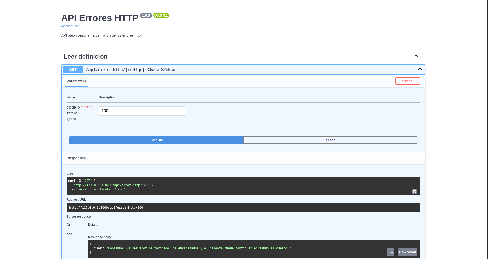

# api-errores-http

## 📌 Descripción
Este proyecto forma parte de mi portafolio personal.  
El objetivo es demostrar buenas prácticas de programación, organización y documentación en GitHub.

## 📦 Instalación
**Crear entorno virtual**

```bash
python -m venv venv
source venv/bin/activate  # En Windows: venv\\Scripts\\activate
```

**Instalar dependencias**

```bash
pip install -r requirements.txt
```

## 🎯 Uso
**Ejecutar el servidor**

```bash
fastapi dev main.py
o
uvicorn main:app --reload
```

**Abrir OpenAPI (Swagger)**

http://127.0.0.1:8000/docs

**Uso desde swagger**



## 📜 Licencia
Este proyecto está bajo la licencia **MIT**.  
Consulta el archivo [LICENSE](LICENSE) para más detalles.
